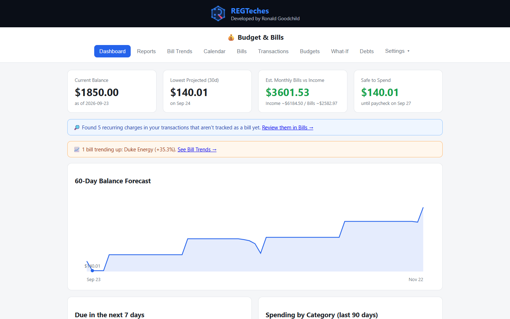
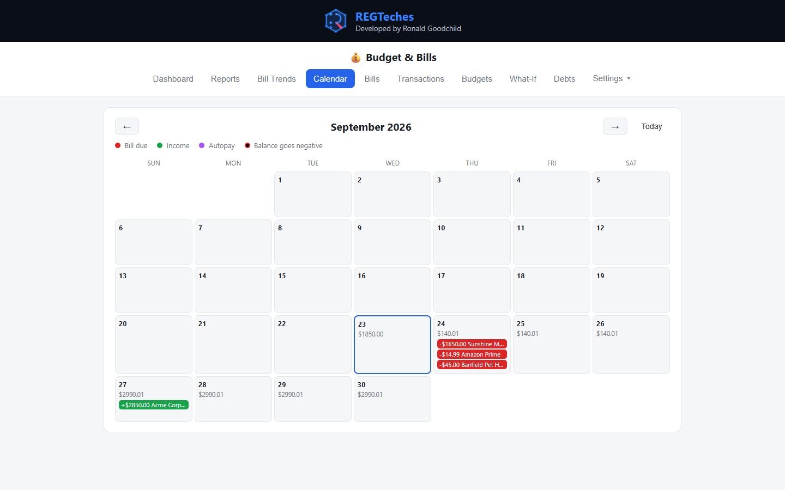
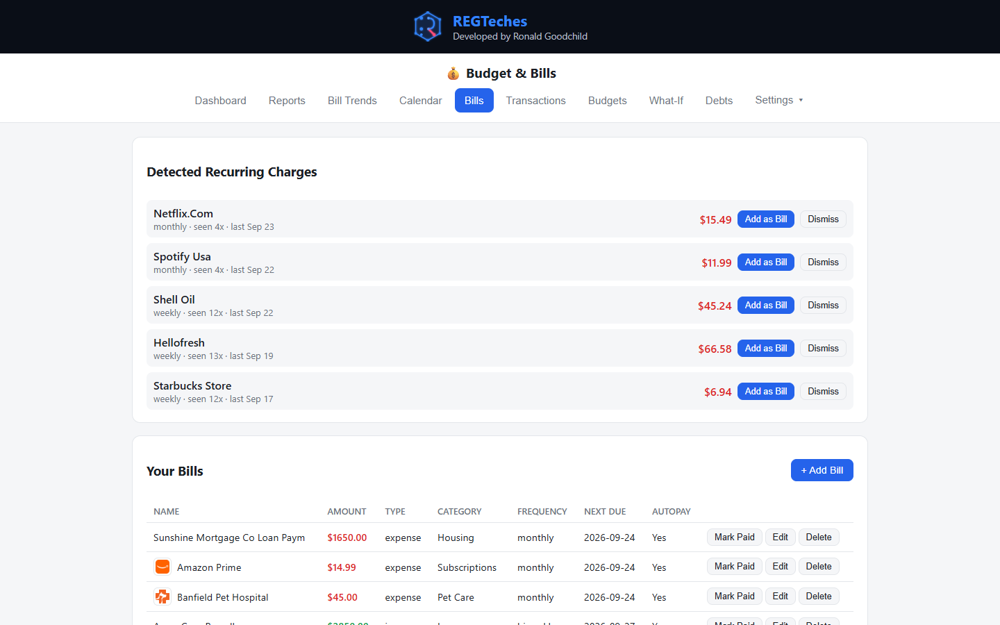

# Budget & Bills

A free, **local-first budgeting app** for your checking account. Import your bank's CSV export, track bills on a calendar, and get warned *before* you overdraft. Runs on your own PC in your browser; your data lives in a single SQLite file.

> Built by a working IT technician for his own household. All the demo data in this repo is fictional.

## Screenshots


*Dashboard: safe-to-spend, 60-day forecast, bill alerts (fictional data)*


*Calendar with projected balance per day*


*Detected recurring charges and tracked bills*

## Features

- **CSV import** with auto-categorisation (overridable per merchant) and duplicate-safe re-imports
- **Recurring-charge detection** - finds subscriptions, bills and paychecks and suggests them as tracked bills
- **Bills** with frequency, next-due date, payment history (one-click undo) and optional "Pay Online" link
- **Auto-reconcile** - matches new transactions to bills and marks them paid; ambiguous matches become one-click suggestions
- **Calendar** with a projected running balance, so you can see which days are tight
- **Dashboard** - due this week, lowest projected balance, **Safe to Spend**, 60-day forecast, spending by category, **Money Leaks**
- **Budgets**, **What-If** (test moving a bill's due date), **Debts** (payoff date, interest, extra-payment impact)
- **Reports** and **Bill Trends** (spot bills creeping up)
- **Notifications** - bill-due and low-balance alerts by SMS gateway, email digest or ntfy push
- **Calendar export** (`.ics`), **JSON backup**, **Clear All Data**
- Installable on your phone as a home-screen web app

The app never touches your money - "Pay Online" just opens the biller's own site.

## Quick start

```bash
git clone https://github.com/ronaldgoodchild/budget-and-bills.git
cd budget-and-bills
pip install -r requirements.txt
python seed_demo_data.py      # optional: load fictional sample data to look around
python app.py                 # opens http://127.0.0.1:5000
```

On Windows you can double-click `start_budget.bat`. If port 5000 is busy it picks the next free one.

When you are ready to use it for real: **Settings > Danger Zone > Clear All Data** (type `RESET`), then import your bank CSV (`DATE, DESCRIPTION, AMOUNT, CHECK #, STATUS` - see `sample_checking.csv`) and set your current balance.

**Docker:** `docker compose up -d` (bound to localhost only; data in `./data`).

## Privacy and security

- Everything runs locally; your database is `data/budget.db` (git-ignored - never commit it).
- Bill-company favicons are fetched from DuckDuckGo's free icon service using only the company's *domain name*. No transaction or balance data is sent.
- **There is no login.** By default the app listens on `127.0.0.1` only. `start_budget_lan.bat` (for using it from your phone) exposes it to your whole network - use it only on a network you trust.
- SMTP / SMS settings you enter are stored in the local database in plain text, and the JSON backup includes them. Treat backups as sensitive.

## Contributing

Ideas and pull requests welcome - see [CONTRIBUTING.md](CONTRIBUTING.md) and [ROADMAP.md](ROADMAP.md).

## License

[MIT](LICENSE) (c) 2026 Ronald Goodchild / REGTeches
